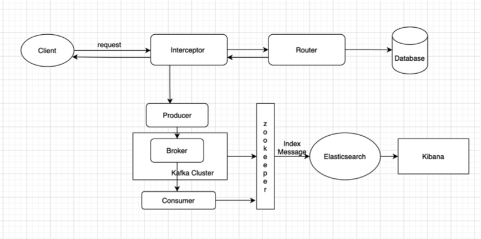
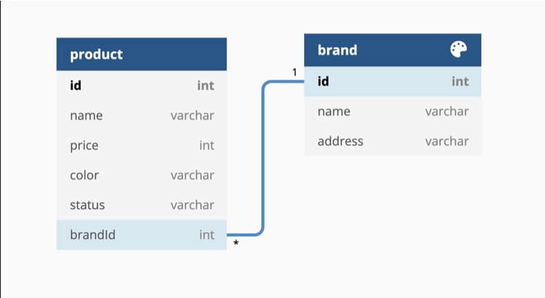
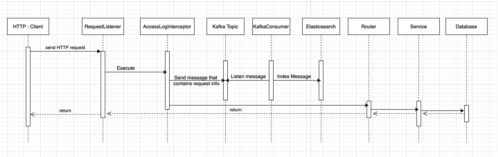

# nest-i-commerce-project
### Built With
* [Nest](https://github.com/nestjs/nest)
* [Jest](https://github.com/facebook/jest)
* [KafkaJS](https://github.com/tulios/kafkajs)
* [Elasticsearch](https://www.npmjs.com/package/@elastic/elasticsearch)
* [husky](https://github.com/typicode/husky)

Folder Structure Conventions
============================

> Folder structure options and naming conventions for software projects
### A typical top-level directory layout
    .
    ├── ...
    ├── src/                                  # Source files
    │   ├── brands/                           # Brands Module
    │   ├── common/                           # Application-wide shared classes
    │   ├── config/                            # Application-wide configuration variables
    │   ├── consumer/                         # Kafka Consumer Module
    │   ├── es/                               # ElasticSearch Module
    │   ├── interceptors/                     # Application-wide Interceptors
    │   ├── kafka/                            # Kafka Abstraction Module
    │   ├── producer                          # Kafka Producer Module
    │   ├── products/                         # Products Module
    │   └── app.module.ts                     # Root Module
    │   └── main.ts                           # The entry point of application
    ├── test/                                 # Automated end-to-end testing module
    ├── Dockerfile                             # Dockerfile for API service
    ├── docker-compose.yml                    # Compose config file defining container services
    ├── package.json                          # Config of npm
    ├── package-log.json                      # Log of Config of npm -  need it to run docker
    └── README.md

## System Architecture

The formal description and representation of this application.



* Entity relationship diagram



* Sequence diagram for API get Brand by its ID: <b>/brands/1</b>




## Installation and Running

1. Clone source

2. Navigate to source code directory
```sh
cd i-commerce-project/
```

3. Start docker comporse
```sh
docker-compose up
```

4. Stop docker comporse when done
```sh
press Ctrl+C
```

```sh
docker-compose down
```

## Usage

### Brands
1. Add brands
```sh
curl -H  "accept: application/json" \
-H  "Content-Type: application/json" \
-d "{\"name\":\"New Brand\",\"address\":\"USA\"}" \
-X POST "http://localhost:3000/brands"
```

2. Get All Branch
```sh
curl -H  "accept: application/json" -X GET "http://localhost:3000/brands"
```

3. Get brand by Id
```sh
curl -H "Accept: application/json" \
-X GET http://localhost:3000/brands/{$brandId}
```

4. Delete brand
```sh
curl -H  "accept: application/json" -X DELETE "http://localhost:3000/brands/${brandId}"
```

### Product

1. Create Product
```sh
curl -H  "accept: application/json" \
-H  "Content-Type: application/json" \
-d "{\"name\":\"New Product\",\"status\":\"AVAILABLE\",\"price\":1000,\"color\":\"red\",\"brandId\":${brandId}}"\
-X POST "http://localhost:3000/products"
```

2. Get ALL Product
```sh
curl -H  "accept: application/json" -X GET "http://localhost:3000/products"
```

3. Get Product By ID
```sh
curl -H "Accept: application/json" -H "Content-Type: application/json" -X GET http://localhost:3000/products/{$productId}
```

4. Delete Product
```sh
curl -H  "accept: application/json" -X DELETE "http://localhost:3000/products/${productId}"
```

### Search

Search by
criterion : - color, name, brand
value : filter
```sh
curl -H "Accept: application/json" -X GET http://localhost:3000/search?criterion=color&value=red
```

Get all of search by client
```sh
curl -H  "accept: application/json" -X GET "http://localhost:3000/sales-topic"
```